# Flutter_tests
This repo is Flutter App testing purpose. Repository contains different test Widgets

# Animated login page #

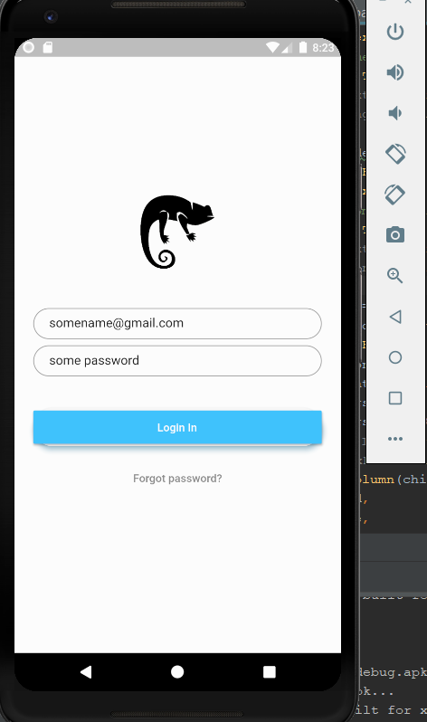
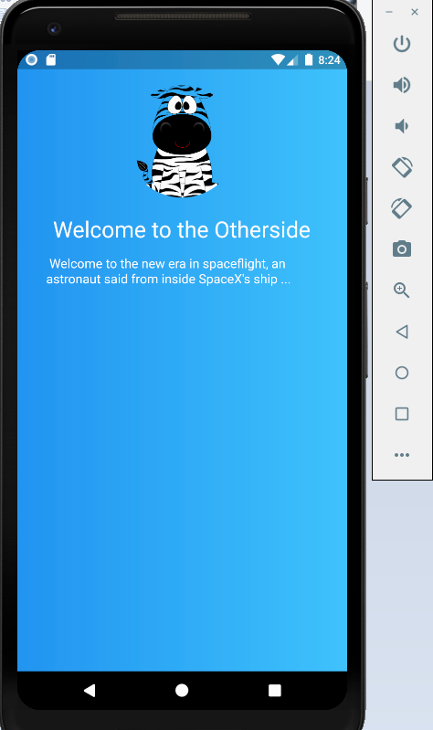

# Flip Card #

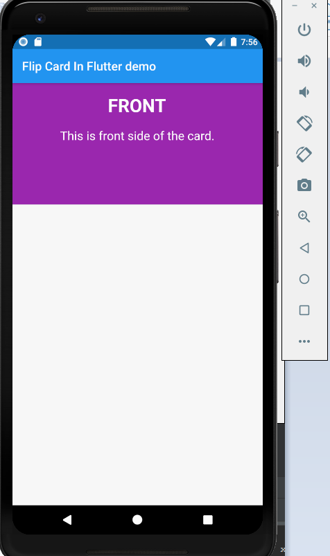
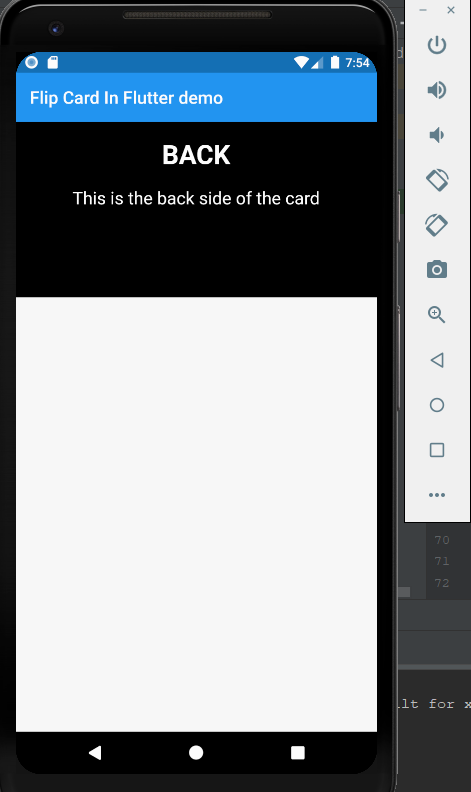

# Splash page #

Spash page purpose is just to showcase their app/company logo for a couble seconds

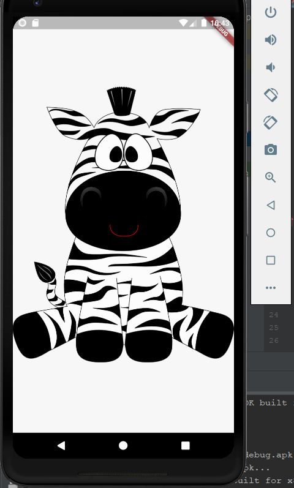
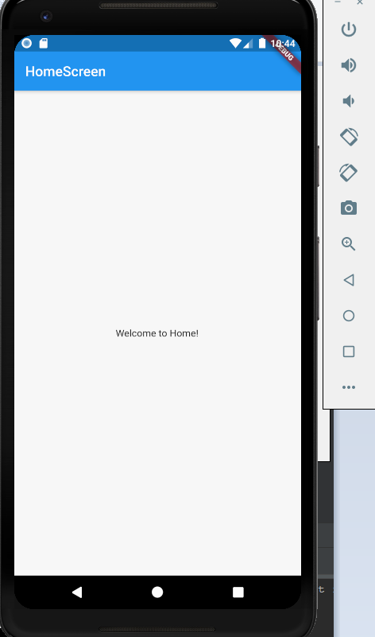

# Grouped Buttons #

A set of Flutter widgets that makes grouping Checkboxes and Radio Buttons much easier!

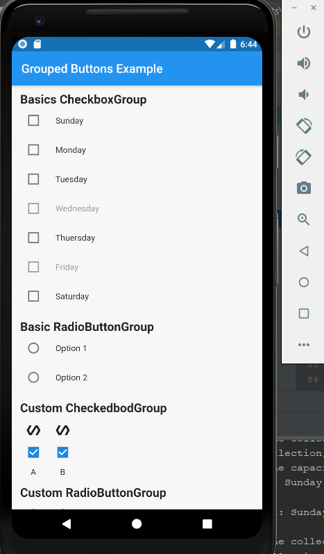

# Saving data #

## Reference ##
https://pusher.com/tutorials/local-data-flutter
https://github.com/suragch/flutter_saving_data  

How to save data locally in Flutter

It's rare app that doesen't need to store some sort of data. 
1. Print console
2. SQLite database
3. Text file

## 1 ##

Printing saved data console

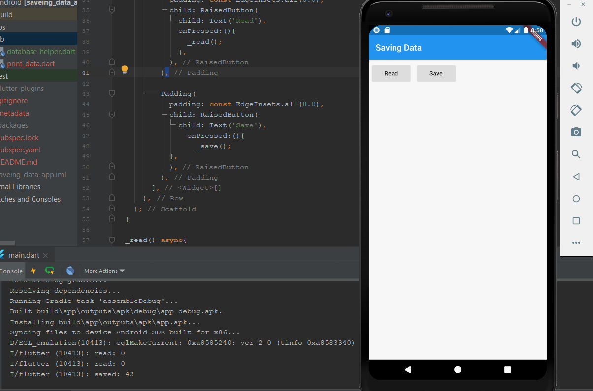

## 2 ##

Saving data SQLite database and read data

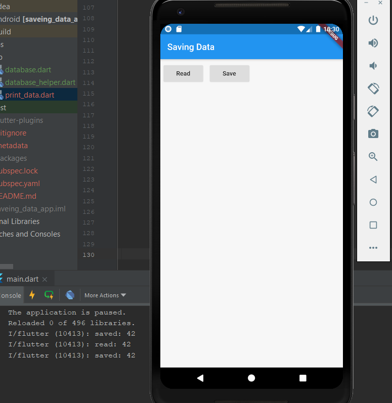

## 3 ##

Saving and read data text file

# Reset Checknox example #

How  Reset checkboxes on button click in flutter

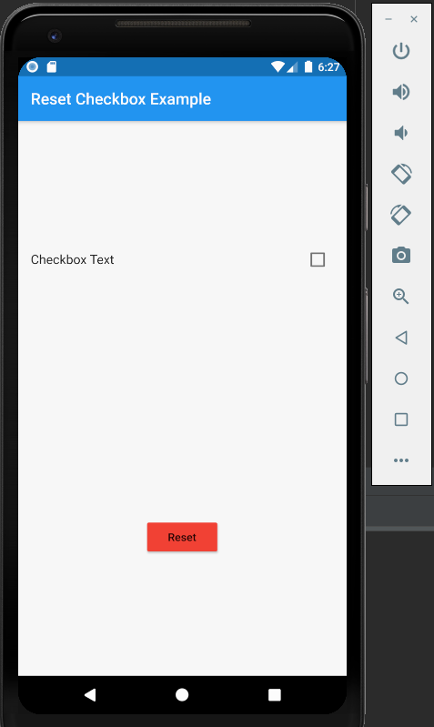

# Send data to a new Screen #

Often you not only want to navidate to a new screen, but also pass data to the screen as well. For example, your might want to pass information about the items that's been tapped

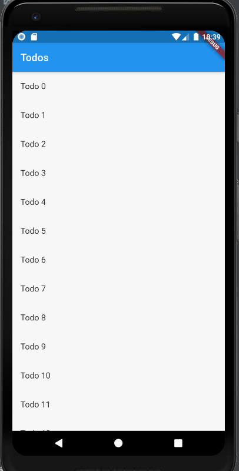
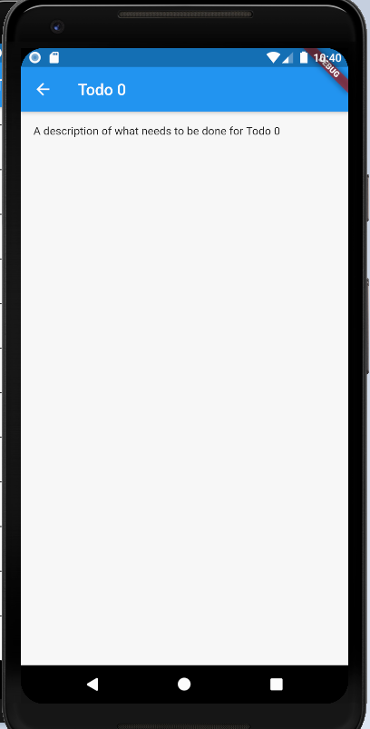

# Global Variable Demo App #
This application is demo how to use global variables

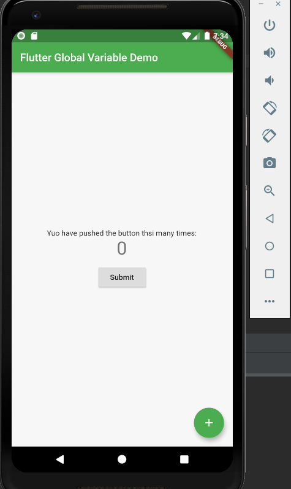
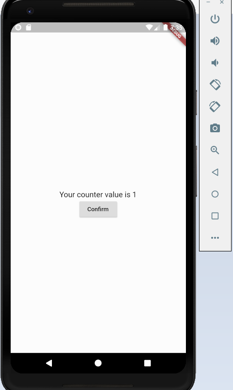
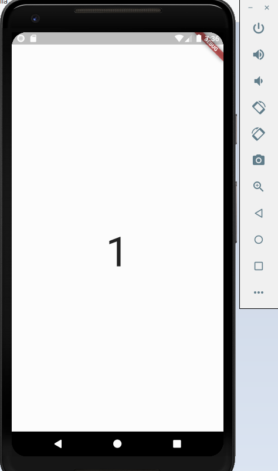

# SQFLite Database in Flutter #
SQFLite is a Database pugin for flutter. It is highly reliable and embedded Database engine. For CRUD operation we are using async and await. Typically these leywords are used to write
asynchronous code.

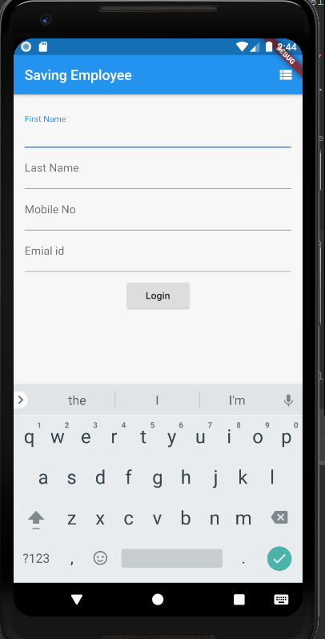
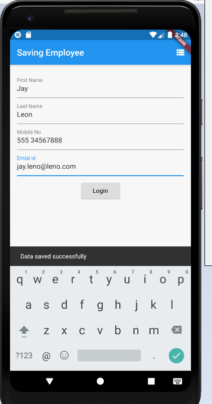

# Solitaire application #

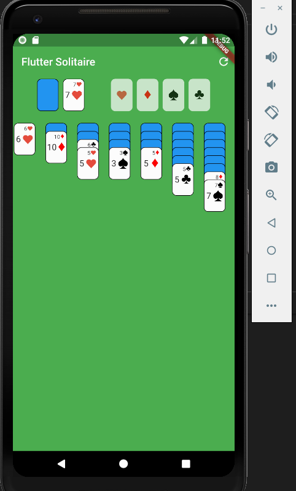

# Stepper Touch #

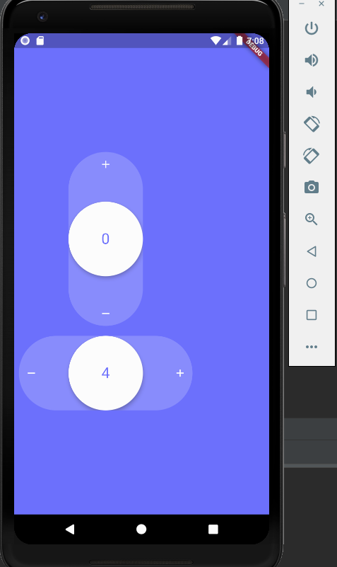